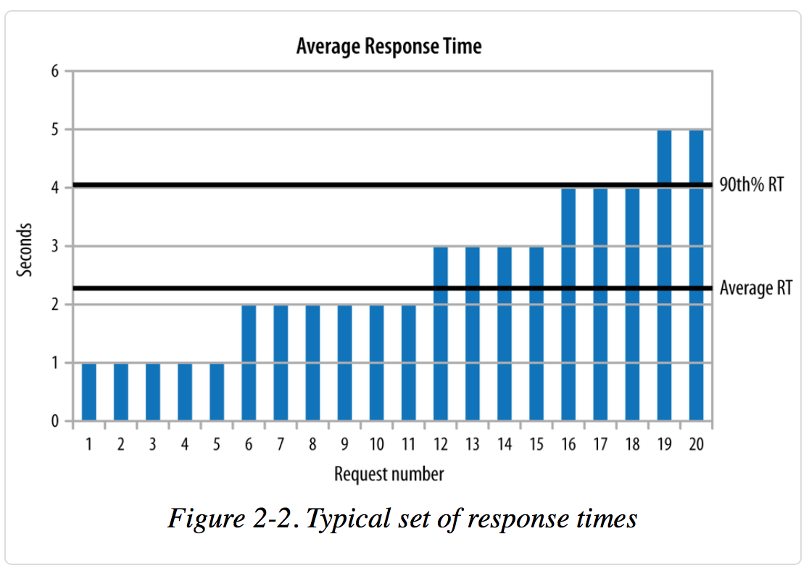
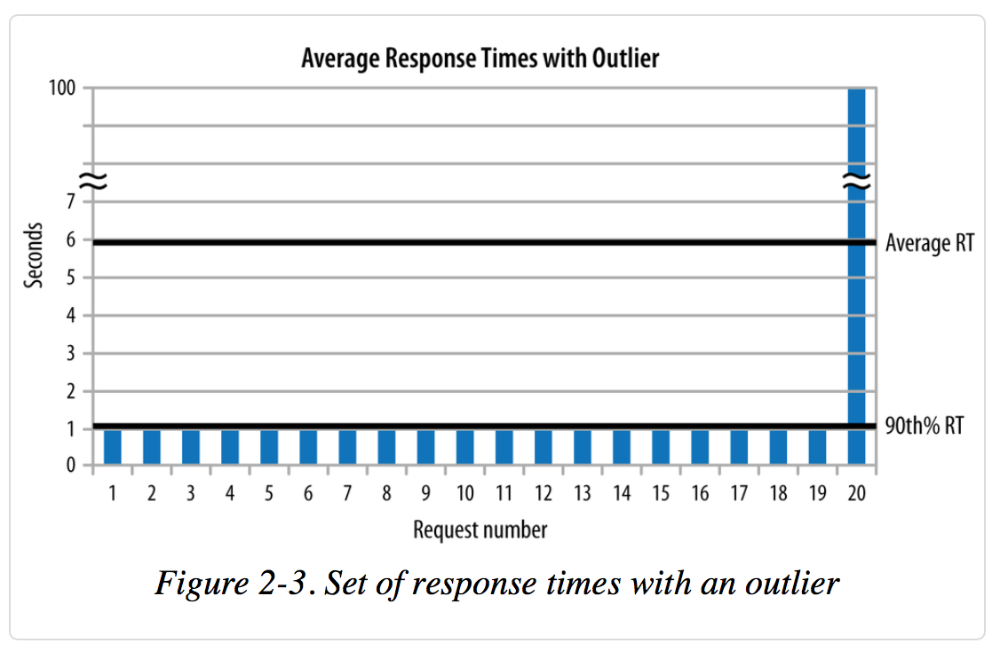

## 2 章 性能测试方法

### 4个性能测试的准则

- #### 准侧1：测试真实的应用(实际生产环境)
性能测试应该在真实的生产环境（或者与生产环境等价的条件）中发生。严格来说有三种粒度的性能测试，各有利弊。
	* ##### microbenchmark(微基准测试)
	微基准测试用来测试非常小的性能单元：
		- 同步（synchronized）方法调用 VS 非同步（nonsynchronized）方法调用的时间比较；
		- 新建线程对象和使用线程池的性能对比；
		- 同一个问题两种实现算法的执行时间比较；等等

		微基准测试想法很好，但是很难正确编写测试代码。
		* 微基准测试必须使用被测试代码的返回结果，这样保证被测试代码被执行到，因为有些时候编译器会智能的优化代码
		* 微基准测试不能引入多余的操作影响被测试代码的性能指标
		* 微基准测试必须度量正确的输入，或者说是真实的输入，测试用例的设计要基于生产环境下可能的输入，不可能的输入测试没有意义。

		微基准测试不仅很难编写，而且很多时候看不出明显的作用，这就需要权衡，做微基准测试是否值得，是不是应该做更宏观层面的基准测试。

	* ##### macrobenchmark（宏基准测试）
		- 系统的整体性能测试（full application）
		- 测试整个系统会得到和各模块分开测试完全不同的结果，因为系统个部分之间互相影响和制约。
		- 整体测试在于找到系统的瓶颈所在，重点优化关键部分，排出各部分应该被关注和优化的优先级。

	* ##### mesobenchmark（中度基准测试，介于微和宏之间）
		- 中度基准测试不仅限于Java EE领域，这个术语表示做实际的性能测试工作，但又不是对整个系统的测试。
		- 中度基准测试不像微基准测试有那么多陷阱，同时比宏基准测试更容易操作。
		- 中度更容易多线程：在中度测试中更容易发现代码在整个系统运行时因为线程同步带来的瓶颈问题，这些瓶颈会在系统真实环境中因为过大的负载而暴露出来。
但是中度基准测试不是完美的，有时候会误导开发者得到错误的结果。
		- 中度测试适合自动化测试，特别是在模块级别的自动化。

	> 小结：微观基准测试难写且作用有限，如果非要写，只能是对所测代码有一个性能上的概念，测试结果不值得依赖；宏观基准测试也就是对系统整体的性能测试是了解真是性能的唯一途径；模块级别或操作级别的中度测试，可以得到合理的性能结果，但不能作为宏观基准测试的替代。

- #### 准侧2：性能指标度量
	__吞吐量（Throughput）批操作（Batching）响应时间（Response Time__

	时间度量是最简单的性能度量方法：计算完成一项特定任务（批处理）或操作系统所需要的时间。
	Java应用的性能测试需要特别关注程序冷启动和热身（warm-up）阶段：度量java应用性能应该在程序运行了足够长时间并且代码已经便已完成并被编译器优化过之后的阶段。
	关于warm up
	warm-up之后环境可能会：缓存。

	- ##### 吞吐量度量
	特定时间内能够完成的最大工作量或操作
	OPS=Operations Per Second
	0.5s 响应时间 500 OPS 可能比0.3s 响应时间 400OPS更好

	- ##### 响应时间测试
	测试响应时间和吞吐量的不同之处在于：
	测响应时间，每次请求之间要求间隔一定时间（think time）
	两种方式度量响应时间：总时间除以总请求得到的平均响应时间，所有真实响应时间的排序取90%或其他百分点,性能测试惯用90%点（或者有时95th% or 99th%）。统计学中的选点。
	两个例子：
	
	

	> 小结：面向批处理的测试在java性能测试中已经不常用了，但确实可以得出有价值的结果；
吞吐量或者响应时间的测试，区别是think time。

- #### 准侧3：理解可变性 variability
	> 小结：用统计学的观点判断不同测试之间的偏差是否正常，使用t-测试；平衡和判断这种偏差也是性能工程师艺术性的一部分。

- #### 准则4：早测试，多测试
	- 严格来说，性能测试应该是软件开发周期中必须的一个环节。理想的情况是，代码集成之后就应该跑性能测试。现实是，很多情况下尽早测试不能实现，需要等到功能开发完代码集成之后。
	- 经常测试在遵循以下原则时非常有用：
		- 自动化测试
		- 度量一切可以度量的指标:CPU%, 硬盘用量，网络占用，内存使用%。同时也应该包含系统其他相关部分的性能数据，隶属数据库日志（e.g. Oracle 的 awr report）， java相关的 GC ，heap 等。
		- 测试要跑在目标系统（与生产环境相等配置）上：任何与最终生产环境不一致的环境测试结果都不可靠甚至是错误的！